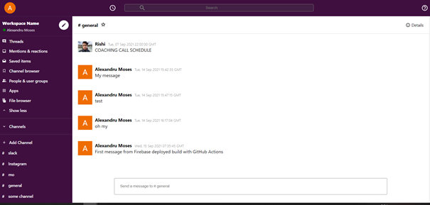
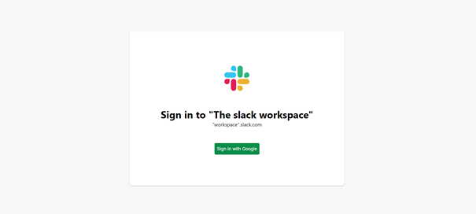
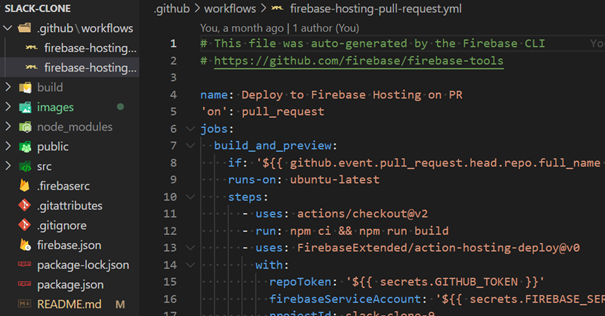
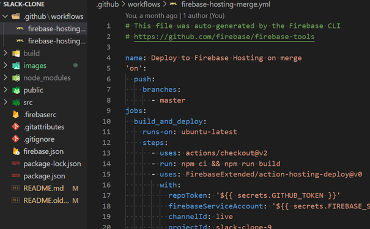
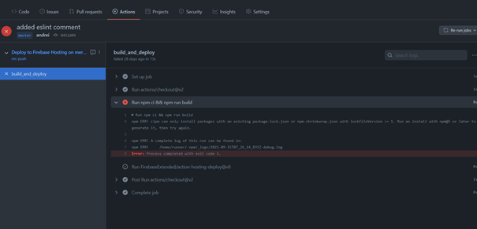
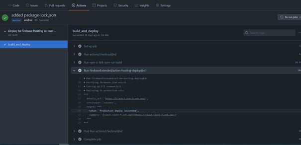
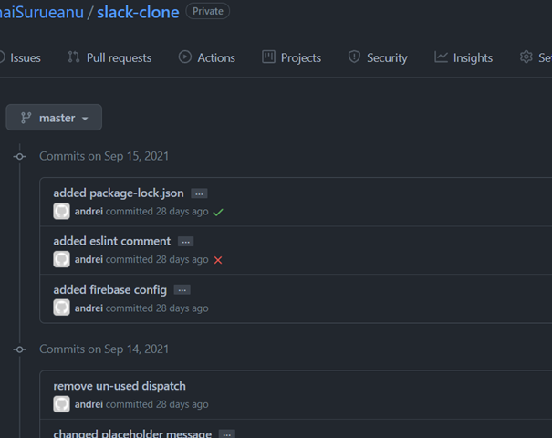

# Slack clone React App

<p align="center">
    
</p>

This project cosists of a **React** app ⚛️ Which has as a theme, *The Slack Web App*. The app makes the use of modern **Functional components** and **React hooks**. The project uses the **React Context API** for storing the user in a global state accessible for all the components from anywhere within the application down the component tree by using the created `useStateProvider` hook. The application also uses the **React Router** for managing the routes inside of the application. The project is deployed using **Google Firebase**, and it integrates a **CI/CD** pipeline for automatic inegration and automatic deployment to Firebase for ease of development. The deployment checks run when creating a pull request or when commiting directly to the *main* branch. The project uses the Google Firestore Database that comes with the Firebase suite of features and services. The database is used to store the *"slack"* channels called rooms, and each associated message in that room, with the name of the user, the message, profile picture and a timestamp as the contents.

<br>

# Demo

The project is online:

<h3>

[LIVE DEMO HERE](https://slack-clone9.web.app/)

<br>

# Features

* Login functionality with Google Oauth services using personal Google account credentials 🔐
* Adding a communication channel called room
* Composing a text message
* Showing in real time the conversation history 📚
* Sorting messages in conversation from oldest to most recent
* Firestore database storage of messages inside each room

<br>

# Technologies used :
<br>
<h2> 

&nbsp;&nbsp;&nbsp;&nbsp;&nbsp;
* React  

&nbsp;&nbsp;&nbsp;&nbsp;&nbsp;&nbsp;&nbsp;
* Firebase hosting  

&nbsp;&nbsp;&nbsp;&nbsp;&nbsp;
* Firestore Database &nbsp;&nbsp;&nbsp;

&nbsp;&nbsp;&nbsp;&nbsp;&nbsp;&nbsp;

* CI/CD pipeline &nbsp;&nbsp;&nbsp; 

&nbsp;&nbsp;&nbsp;&nbsp;&nbsp;&nbsp;

* Material UI &nbsp;&nbsp;&nbsp; 
</h1> 
</br>

## Log in page 
</br>
<p align="center">
    
</p>


# CI/CD

The rules for the CI/CD pipeline are present in a github workflows folder inside of the project. The rules are contained inside of two files used by firebase when commiting to the main branch and creating a pull request to the main branch: `firebase-hosting-pull-request.yml` and `firebase-hosting-merge.yml`. 




<br>
<br>

In the beginning the first deployment was unsuccesful due to an error



<br>
<br>

The error was caused by the missing of the package-lock.json file and it was fixed by removing the file from the gitignore rules file.

After the fix all the checks from the automatic deployment on Firebase have passed and the site went live



<br>
<br>

Now when creating a pull request to the main branch or when commiting directly on the main branch,
 the automatic deployment rules execute and run the checks for the new build.


<br>
<br>
<br>


# To run the project locally

## Pre-requisites:
- node installed (e.g. version used: v14.15.1)
- npm installed (e.g. version used: 6.14.8)

## Steps:

1. Clone the repository
2. Open the command line in the project folder.
3. From the command line write the following comands in order:
```
npm i
npm start
```
4. If port 3000 is not in use, then the React app will start at:
- http://localhost:3000

### Have fun with project and thank you for your attention. 😊 😉
